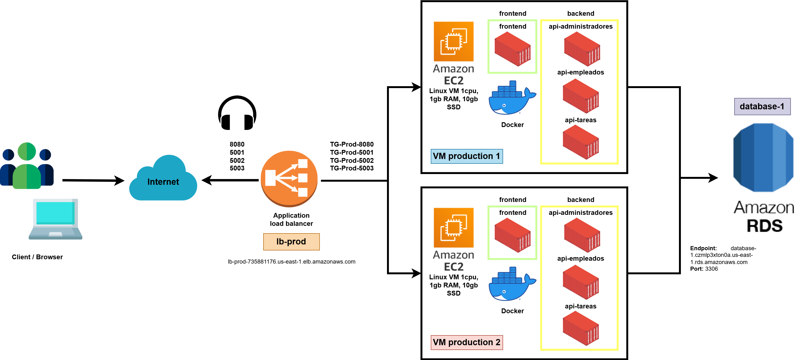

# Sistema de administración de empleados y tareas TAMBO

Hoy en día, muchas empresas están buscando
herramientas que mejoren la productividad de su
personal administrativo y empleados. Es por ello,
que se requiere de software que organice sus
recursos y se ajuste a sus necesidades. En ese
marco, nace este proyecto que pretende solucionar
estos problemas en aquellas organizaciones que
buscan máxima eficiencia. Entre estas se encuentra
la cadena de tiendas Tambo+, siendo nuestro
proyecto a quien va dirigido.

  

## Diagrama de solución

