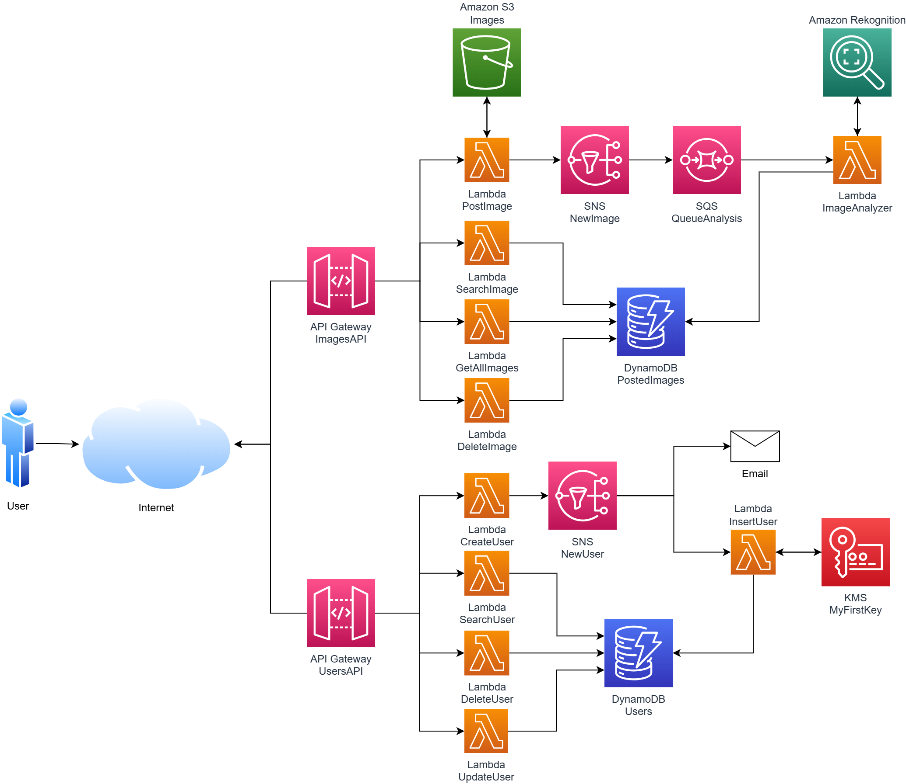

# *Smart Album*

## Caso de uso
*Smart Album*  es  una  aplicación  serverless  Multi-tenancy con Arquitectura basada en eventos capaz de  automáticamente  organizar  fotografías  en  basea  objetos,  escenas  y  personas.  Este  utiliza  Amazon Rekognition  para  etiquetar  y  categorizar  las imágenes  subidas  en  un  bucket  de  Amazon  S3  y guardar  la  metadata  en  Amazon DynamoDB  cuando  el usuario lo requiera.

   
  

## Servicios utilizados

- **Development:** Lambda, API Gateway
- **Storage:** S3
- **Database:** DynamoDB
- **Messaging:** SQS, SNS
- **AI:** Rekognition
- **Security:** KMS

## Diagrama de solución

